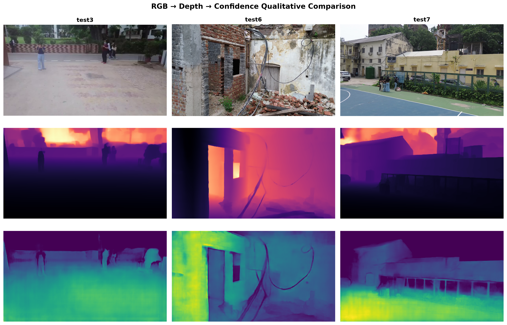
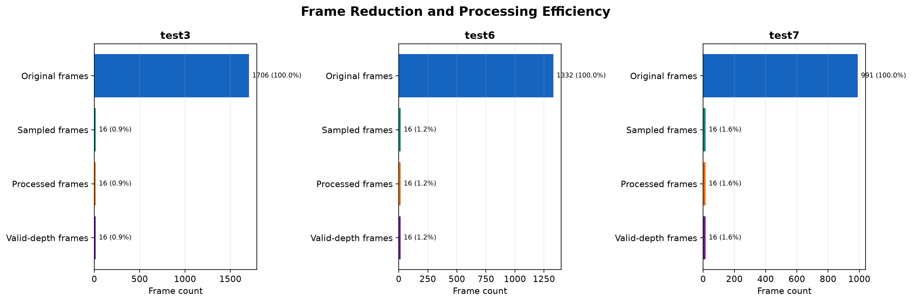

<h1 align="center">DRIFTX</h1>

<p align="center"><strong>Single-pass UAV video to georeferenced 3D reconstruction</strong></p>

<p align="center">
  <a href="output_figures/three_video/fig07_rgb_depth_confidence.png"></a>
</p>

<p align="center">
  <a href="https://www.sih.gov.in/"></a>
  <a href="https://www.sih.gov.in/"></a>
  <a href="#team"></a>
  <a href="LICENSE"></a>
</p>

<p align="center">
  <a href="https://youtu.be/SbHBuNRiBy0?si=YY_6_MCjsUT28tbU">Demo Video</a> ·
  <a href="https://driftx-3d.netlify.app">3D GIS Mapping</a> ·
  <a href="https://drift-ai-ml-platform-eta.vercel.app">DRIFTX Platform</a> ·
  <a href="https://unified-drift.vercel.app/">Unified DRIFTX</a> ·
  <a href="https://drift-mount-sensor.vercel.app">Mounted Sensor</a> ·
  <a href="https://drift-railway-monitoringfinal.vercel.app">Ground Sensor</a> ·
  <a href="https://drive.google.com/drive/folders/1Q0B5aicu5Dfpc6XMTm1Ab7SFssd3LbT4?usp=sharing">3D Evidence</a> ·
  <a href="https://drive.google.com/drive/folders/1PHKRjv1DuH13bNDnd8J1dq7mxk00dccJ?usp=sharing">Three-video Results</a>
</p>

<p align="center"><em>One flight + limited views → bounded processing → inspectable 3D geometry.</em></p>

DRIFTX converts a continuous UAV video into a temporally ordered, quality-filtered frame stream; estimates depth and camera geometry with a frozen **Depth Anything 3 (DA3)** backbone; aligns overlapping local reconstructions with confidence-weighted **Sim(3)** transforms; and exports a global scene for inspection.

The project targets the Smart India Hackathon 2026 **Problem Statement 26158: “Single-Pass Drone Video to Accurate 3D Model Generation System”** under **Robotics & Drones** for **NTRO**.

> **Accuracy note:** the repository contains measured runtime, memory, artifact, and reconstruction diagnostics. The proposal target of **≤1 m spatial accuracy**, **<15 minutes for a 10-minute video**, and full visible-scene coverage requires independent surveyed checkpoints/reference geometry; it is not a universal guarantee.

## Contents

- [Problem and solution](#problem-and-solution)
- [System pipeline](#system-pipeline)
- [Repository structure](#repository-structure)
- [Offline/local setup](#offlinelocal-setup)
- [Run a reconstruction](#run-a-reconstruction)
- [Run the local viewer and API](#run-the-local-viewer-and-api)
- [Benchmark profiles and metrics](#benchmark-profiles-and-metrics)
- [Output contract](#output-contract)
- [Technical implementation](#technical-implementation)
- [Multimodal vibration subsystem](#multimodal-vibration-subsystem)
- [Applications and limitations](#applications-and-limitations)
- [Team](#team)

## Problem and solution

Conventional aerial mapping often depends on repeated passes, high image overlap, large image collections, and long post-processing cycles. That is a poor fit for disaster zones, unsafe infrastructure, inaccessible terrain, and time-critical inspections where only one flight may be available.

DRIFTX addresses that constraint by:

- accepting one continuous moving-UAV video as the primary observation stream;
- preserving source-frame identity and timestamps through sampling and export;
- filtering blur, near-duplicates, low-confidence regions, and invalid geometry;
- processing bounded overlapping frame windows instead of loading the entire video into GPU memory;
- aligning adjacent local reconstructions using shared frames and confidence-weighted 3D correspondences;
- exporting GLB, PLY, NPZ, camera metadata, depth/confidence visualizations, metrics, and a machine-readable run report;
- optionally correlating spatial reconstruction with synchronized vibration-condition data.

## System pipeline

<p align="center">
  <a href="output_figures/three_video/fig03_frame_pipeline.png"></a>
</p>

```text
UAV video + optional GNSS/RTK/PPK, IMU, EXIF/XMP, calibration
                              │
                              ▼
CPU decode → deterministic sampling → blur/dedup/quality checks
                              │
                              ▼
Depth Anything 3 → per-frame depth, rays, confidence, camera geometry
                              │
                              ▼
Bounded overlapping windows → shared-frame correspondences
                              │
                              ▼
Confidence-weighted Sim(3) alignment → global scene merge
                              │
                              ▼
PLY / GLB / NPZ / depth views / metadata / metrics / run report
                              │
                              ▼
Local API + WebGL inspection viewer
```

### Operating modes

- **Mode A — bounded streaming baseline:** deterministic sampling, bounded DA3 windows, overlap alignment, CPU staging, and structured export. This is the reproducible local smoke path.
- **Mode B — survey workflow:** extends the baseline with telemetry, camera calibration, control points, checkpoints, scale recovery, and georeferencing validation.
- **Optional Gaussian branch:** available only with a DA3 checkpoint that exposes a compatible Gaussian head and a separately compiled `gsplat` installation. The default DA3 Large 1.1 baseline is depth/pose-capable, not Gaussian-capable.

## Repository structure

| Path | Responsibility |
|---|---|
| `driftx/` | Product CLI, orchestration, streaming benchmark, reconstruction, validation, export, API, and doctor commands |
| `frozen_ml/3d/` | Frozen model/runtime implementation retained for compatibility |
| `src/depth_anything_3/` | Install-time compatibility import path for the DA3 package |
| `da3_streaming/` | Sliding-window video inference utilities |
| `frontend/` | Vite + Three.js WebGL inspection interface |
| `scripts/` | Benchmark and figure-generation helpers |
| `input/` | Tracked sample images and videos |
| `outputs/` | Tracked example GLB scenes and depth visualizations |
| `output_figures/` | Benchmark dashboards, frame pipeline, confidence, temporal, trajectory, and scaling figures |
| `docs/` | CLI, API, benchmark, streaming design, deployment, and evidence documentation |
| `tests/` | CPU-safe unit and integration-contract tests |
| `cloud/` | Optional notebook workflows for larger/Gaussian experiments |

## Offline/local setup

The following procedure runs the repository locally. The only step that needs network access is the initial installation and model-weight download. After the dependencies and checkpoint are present, inference, export, API serving, and frontend inspection run on the local machine.

### Requirements

- Python **3.9–3.13**; Python 3.11 is recommended.
- Git.
- Node.js and npm for the WebGL frontend.
- NVIDIA GPU with a compatible CUDA-enabled PyTorch wheel for practical DA3 inference. CPU is useful for tests, CLI inspection, and API/viewer work but is not a practical path for full reconstruction.
- Sufficient disk space for PyTorch, DA3 weights, extracted frames, and generated GLB/PLY artifacts.

### 1. Clone and create an isolated environment

#### Linux/macOS shell

```bash
git clone https://github.com/hitakshijoshi20072911/drift-3d.git
cd drift-3d
python3 -m venv .venv
source .venv/bin/activate
python -m pip install --upgrade pip
```

#### Windows PowerShell

```powershell
git clone https://github.com/hitakshijoshi20072911/drift-3d.git
cd drift-3d
py -3.11 -m venv .venv
.\.venv\Scripts\Activate.ps1
python -m pip install --upgrade pip
```

### 2. Install PyTorch and DRIFTX

Install a CUDA-enabled PyTorch wheel appropriate for the installed NVIDIA driver. The package name is `torch`, not `pytorch`.

```bash
# Example CUDA wheel; use the wheel matching the target machine.
python -m pip install torch torchvision torchaudio --index-url https://download.pytorch.org/whl/cu128
python -m pip install -e ".[figures]"
```

For a CPU-only environment used for tests and API development:

```bash
python -m pip install -e ".[figures,test]"
```

Verify the install:

```bash
python -c "import torch; print('Torch:', torch.__version__); print('CUDA available:', torch.cuda.is_available()); print('GPU:', torch.cuda.get_device_name(0) if torch.cuda.is_available() else 'none')"
python -m driftx --help
python -m driftx doctor --json
```

### 3. Download the DA3 Large 1.1 checkpoint

Keep model weights outside Git. Download into a regular local directory so the same path can be reused offline:

```bash
python -c "from huggingface_hub import snapshot_download; snapshot_download('depth-anything/DA3-LARGE-1.1', local_dir='models/DA3_LARGE_1.1_SAFE')"
```

Set the model path for the current shell:

```bash
export MODEL_DIR="$PWD/models/DA3_LARGE_1.1_SAFE"
```

PowerShell:

```powershell
$env:MODEL_DIR = "$PWD\models\DA3_LARGE_1.1_SAFE"
```

### 4. Run CPU-safe verification before inference

```bash
python -m unittest discover -s tests -v
python -m compileall -q driftx src frozen_ml app_live.py da3_streaming
python -m driftx benchmark --help
```

These checks cover profile defaults, window coverage, overlap alignment, OOM fallback sizing, artifact contracts, mocked benchmark paths, and API contracts. They do not validate GPU quality or geographic accuracy.

## Run a reconstruction

### Reconstruct an example image folder

```bash
mkdir -p workspace/gallery
python -m depth_anything_3.cli auto input/SOH \
  --model-dir "$MODEL_DIR" \
  --export-format glb \
  --export-dir workspace/gallery/DRIFTX_SOH
```

The compatibility console command is also available after installation:

```bash
da3 auto input/SOH --model-dir "$MODEL_DIR" --export-format glb --export-dir workspace/gallery/DRIFTX_SOH
```

### Run the recommended smoke benchmark

The smoke profile is the reproducible baseline:

- sample rate: **1 FPS**;
- total sampled-frame cap: **16**;
- processing resolution: **504**;
- window size: **8 frames**;
- overlap: **2 frames**;
- three inference windows for the 16-frame workload;
- automatic conservative VRAM sizing and CUDA OOM retries.

```bash
python -m driftx benchmark \
  --video input/test3.mp4 \
  --output outputs/benchmarks/test3_smoke \
  --model "$MODEL_DIR" \
  --device cuda \
  --profile smoke
```

Use `--device auto` to let the runtime choose an available device. Use `--device cpu` only for a functional smoke test; full DA3 reconstruction is GPU-oriented.

### Run a longer, higher-quality profile

```bash
python -m driftx benchmark \
  --video input/test3.mp4 \
  --output outputs/benchmarks/test3_quality \
  --model "$MODEL_DIR" \
  --device cuda \
  --profile quality \
  --max-frames 0 \
  --precision auto
```

Available profiles:

| Profile | Sampling | Frame cap | Resolution | Window / overlap | Use |
|---|---:|---:|---:|---:|---|
| `smoke` | 1 FPS | 16 | 504 | 8 / 2 | Reproducible first run |
| `balanced` | 2 FPS | All sampled | 630 | 16 / 4 | More coverage with bounded memory |
| `quality` | 2 FPS | All sampled | 756 | 12 / 4 | Higher-detail reconstruction |

For low-memory GPUs, start with `--chunk-size 8 --chunk-overlap 2`, reduce `--process-res`, or lower `--max-frames`. Run jobs sequentially so GPU memory is not shared between processes.

### Process a video with the compatibility CLI

```bash
python -m depth_anything_3.cli video input/test.mp4 \
  --fps 15 \
  --model-dir "$MODEL_DIR" \
  --export-dir workspace/gallery/DRIFTX_VIDEO \
  --export-format glb
```

## Run the local viewer and API

The repository includes a local FastAPI backend and a Vite/Three.js inspection interface. Precomputed demo scenes can be viewed without running new inference.

### Terminal 1 — backend

```bash
python -m driftx doctor --json
python -m driftx server --host 127.0.0.1 --port 8123
```

Health check:

```bash
curl http://127.0.0.1:8123/api/health
curl http://127.0.0.1:8123/api/demos
```

### Terminal 2 — frontend

```bash
cd frontend
npm install
npm run dev
```

Open the Vite URL printed in the terminal. The viewer supports:

- precomputed demo selection;
- GLB scene loading;
- RGB and depth evidence inspection;
- point, distance, height, area, volume, profile, sight-line, and note tools;
- screenshot and report export;
- raw video upload and asynchronous processing when the backend has model access.

### API surface

- `GET /api/health`
- `GET /api/demos`
- `GET /api/demos/{demo_id}`
- `GET /api/demos/{demo_id}/artifacts/{filename}`
- `POST /api/runs/upload`
- `POST /api/runs/{run_id}/process`
- `GET /api/runs/{run_id}/status`
- `GET /api/runs/{run_id}/manifest`
- `GET /api/runs/{run_id}/artifacts/{filename}`

Useful environment variables:

- `DRIFTX_MODEL` — default checkpoint for uploaded processing;
- `DRIFTX_RUN_ROOT` — persistent run/artifact directory;
- `DRIFTX_API_URL` — frontend API base URL when the backend is separate;
- `DRIFTX_ALLOWED_ORIGINS` — comma-separated CORS origins;
- `DRIFTX_HOST`, `DRIFTX_PORT` — backend bind settings.

### Inspect an existing GLB directly

```bash
python app_live.py outputs/DA3_LARGE_1.1_SAFE/scene.glb
```

The command reports the loaded path, geometry-object count, bounding-box dimensions, and diagonal before opening the local trimesh viewer.

## Benchmark profiles and metrics

### Measured three-video smoke baseline

The repository’s measured CUDA/BF16 smoke runs use DA3 Large 1.1, 16 processed frames per video, chunk size 8, overlap 2, and three inference windows. Source videos are approximately 30 FPS and contain 991–1,706 frames.

| Run | Video duration | Source frames | Wall time | Inference | Export | Throughput | Peak GPU |
|---|---:|---:|---:|---:|---:|---:|---:|
| `test3` | 56.87 s | 1,706 | 43.45 s | 6.02 s | 2.43 s | 0.368 frames/s | 3,879.18 MB |
| `test6` | 44.44 s | 1,332 | 39.04 s | 4.89 s | 2.55 s | 0.410 frames/s | 3,879.18 MB |
| `test7` | 33.07 s | 991 | 35.38 s | 4.63 s | 2.46 s | 0.452 frames/s | 3,879.18 MB |
| **Mean** | **44.79 s** | — | **39.29 s** | **5.18 s** | **2.48 s** | **0.410 frames/s** | **3,879.18 MB** |

Additional measured facts:

- **48/48** selected frames processed successfully;
- **0** CUDA OOM retries in the reported smoke runs;
- **100% finite-depth tensor coverage** in the processed tensors;
- output sizes were approximately **16.0 MB GLB** and **16.0 MB PLY** per run;
- finite-depth coverage is a tensor-validity measure, not geographic scene completeness;
- GPU memory, accuracy, and runtime vary with checkpoint, resolution, hardware, and input motion.

### Longer-video reported metrics

The supplied project report also records a separate three-video evaluation over **537 total frames**:

| Metric | Mean | Range |
|---|---:|---:|
| Reprojection error | **0.543 px** | 0.532–0.554 px |
| DSM/surface-model coverage | **85.8%** | 80.6–91.9% |
| GPS alignment RMSE | **1.92 m** | 1.59–2.25 m |
| Frames registered | **90.4%** | 71.2–100% |

These figures belong to the supplied evaluation record and should be reproduced from the corresponding run reports before being treated as a new benchmark result.

### What is not yet validated by the baseline

The following require independent ground truth and are not established by a visually coherent GLB alone:

- absolute spatial accuracy and the **≤1 m** target;
- surveyed georeferencing error;
- camera ATE/RPE against a reference trajectory;
- depth AbsRel/RMSE/δ1 against ground-truth depth;
- point-cloud/mesh Chamfer, RMSE, and completeness;
- full visible-scene coverage;
- dynamic-mask precision/recall/F1/IoU.

## Output contract

A successful benchmark writes a self-contained run directory similar to:

```text
outputs/benchmarks/<run-name>/
├── input_images/                  # sampled frames
├── scene.glb                      # inspection-ready glTF scene
├── scene.ply                      # point-cloud export
├── results.npz                    # root geometry arrays
├── exports/mini_npz/results.npz   # compact array export
├── depth_vis/                     # depth/confidence visualizations
├── frames.json                    # source-frame and timestamp metadata
├── camera_poses.json              # estimated camera metadata
├── metrics.json                   # measured run metrics
└── run_report.json                # status, timings, memory, errors, artifacts
```

The runner does not silently publish an incomplete scene. If inference or export fails, inspect `run_report.json`, especially `status`, `error`, and `error_traceback`. Preserve the report and artifacts for reproducibility.

## Technical implementation

### Deterministic ingest and preprocessing

- CPU-side video decoding keeps GPU memory focused on geometry inference.
- Sampling retains source-frame number and timestamp.
- Blur rejection can use Laplacian variance.
- Near-duplicate filtering can use perceptual hash/SSIM-style comparisons.
- Optional dynamic masking and confidence thresholds remove unreliable pixels.
- Camera intrinsics, distortion, GNSS/RTK/PPK, IMU, EXIF/XMP, and telemetry are supported as the survey workflow evolves.

### DA3 geometry backbone

- The default baseline uses **Depth Anything 3 Large 1.1**.
- The backbone is treated as frozen for the stable inference path; the project documentation describes selected-layer aerial adaptation using IGDTUW UAV frames.
- DA3 supplies depth and per-pixel ray geometry suitable for direct 3D back-projection:

```text
P = o + D · d
```

where `o` is ray origin, `D` is predicted depth, and `d` is ray direction.

### Windowing and global alignment

- selected frames are split into bounded overlapping windows;
- each window is reconstructed in its own local coordinate frame;
- shared frames generate confidence-weighted 3D correspondences;
- robust residual trimming rejects high-error matches;
- a similarity transform `Sim(3)` maps the next local chunk into the global frame;
- chunks merge in source-frame order;
- insufficient or degenerate overlap causes an explicit failure rather than an incoherent export;
- CUDA OOM recovery retries with smaller windows down to a safe floor.

### Export and validation

- deterministic point-cap logic limits export size;
- CPU/memory-mapped staging avoids retaining all live inference tensors on the GPU;
- artifact existence and report paths are checked after the run;
- metrics are recorded as measured values or `"not measured"`; no GPU result or quality score is fabricated.

## Multimodal vibration subsystem

The companion condition-monitoring prototype is separate from the core visual reconstruction path. It uses an ESP32 and MPU-class three-axis IMU to measure vibration severity, compare it with a calibrated baseline, and emit persistent events.

### Hardware/interface

- **ESP32 Dev Module:** sampling, calibration, event logic, communication;
- **GY-521 / MPU-class IMU:** three-axis acceleration;
- **Prototype wiring:** `VCC → 3V3`, `GND → GND`, `SDA → GPIO21`, `SCL → GPIO22`;
- **Mechanical mount:** rigid, repeatable coupling to the monitored asset;
- **Receiver/dashboard:** serial records and timestamped monitoring storage.

### Prototype event logic

| Parameter | Prototype value |
|---|---:|
| Sampling rate | 200 Hz |
| Analysis window | 200 samples / 1 second |
| Static calibration | 600 samples |
| Baseline RMS calibration | 1,000 samples |
| Event trigger | RMS ≥ 0.100 g for 3 consecutive windows |
| Event clear | RMS < 0.090 g for 3 consecutive windows |

Prototype bench observations:

- quiet baseline: **≈0.0047–0.0050 g RMS**;
- light disturbance: **≈0.0384 g RMS**, peak **≈0.2972 g**;
- strong disturbance: **≈0.3558 g RMS**, peak **≈0.6166 g**;
- sustained high vibration: **≈0.18–0.23 g RMS**, peak **≈1.06–1.45 g**;
- later low-vibration plateau: **≈0.0205–0.0211 g RMS**.

These are prototype observations, not field-calibrated railway safety limits. The intended evidence chain is:

```text
spatial observation → vibration measurement → timestamp correlation → operator review → validation
```

## Applications and limitations

### Intended applications

- disaster assessment: landslides, floods, debris, and post-earthquake inspection;
- infrastructure inspection: roads, bridges, buildings, and asset-condition monitoring;
- urban planning and digital-twin inputs;
- terrain and archaeological documentation;
- aerial inspection where a single safe flight is preferable to repeated passes;
- future multimodal threat/context analysis using thermal, night-vision, LiDAR, GNSS, IMU, and vibration data.

### Current limitations

- absolute georeferencing requires synchronized telemetry, calibration, scale recovery, and independent checkpoints;
- blur, low texture, occlusion, lighting changes, dynamic objects, and weak motion can reduce reconstruction quality;
- the default tracked demos are **precomputed local reconstructions**, not live inference results;
- sensor fusion and domain fine-tuning are project capabilities/roadmap items unless the corresponding local implementation and run artifacts are present;
- Gaussian export requires a compatible checkpoint and optional native `gsplat` build;
- reported runtime is hardware-specific and should not be generalized to a 10-minute video without a new run.

## Team

**ZeroError — Smart India Hackathon 2026**

- Hitakshi Joshi
- Ridhima Kulashri
- Mannu
- Renaissance Das
- Saranya Jogi
- Risha Rastogi

**Institution:** Indira Gandhi Delhi Technical University for Women (IGDTUW)

## License

The repository is released under the Apache-2.0 license. See [`LICENSE`](LICENSE) and [`THIRD_PARTY_LICENSES.md`](THIRD_PARTY_LICENSES.md) for the local license files shipped with the project.
