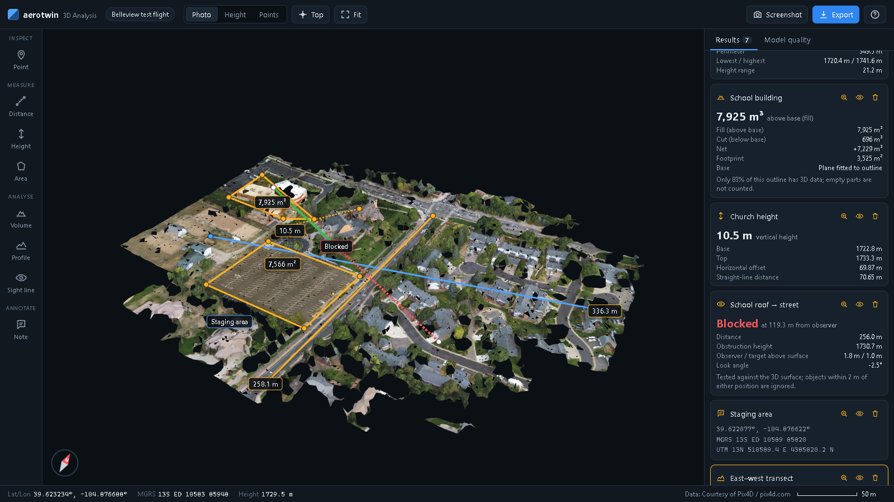
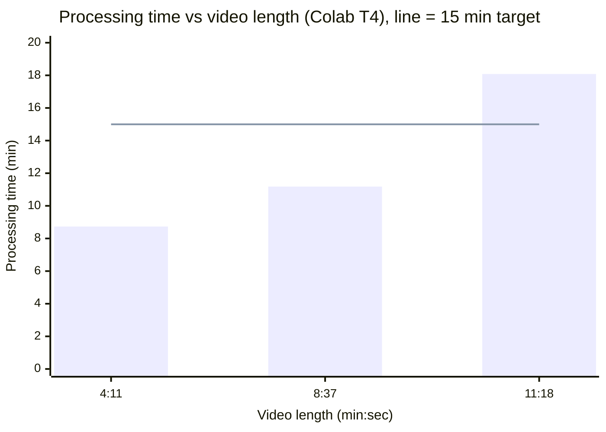
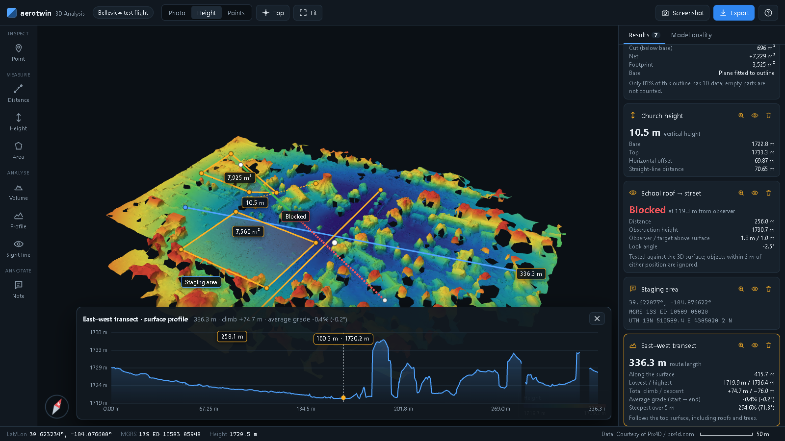
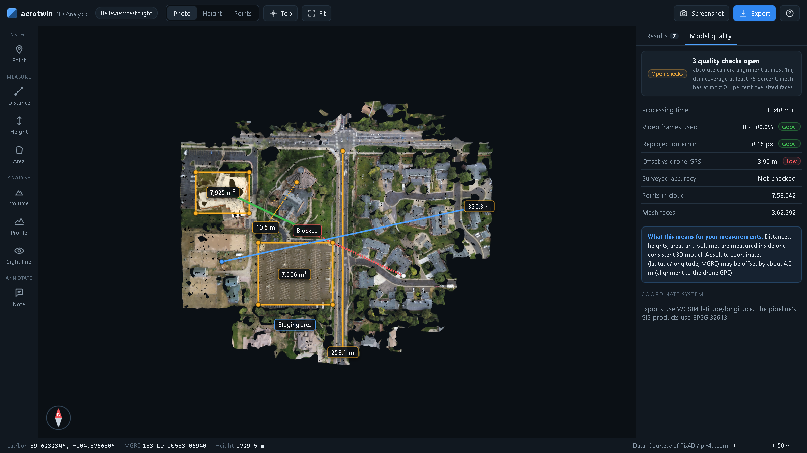

<div align="center">

# drone-video-to-3d

**One drone flight → a georeferenced, measurable 3D model in minutes.**

Single-pass drone video + GPS telemetry in; textured 3D mesh, dense point cloud, GeoTIFF DSM, LAS and a web analysis viewer out.

[**Live viewer**](https://aerotwin.github.io/drone-video-to-3d/?demo) · [**Demo video**](https://youtu.be/DP2WMcqDvOw) · [Pipeline reference](docs/PIPELINE.md) · [Code map](docs/CODE_MAP.md)

Team **DroneX1** · aerotwin · Smart India Hackathon 2026 · Problem statement 26158

</div>


<sub>Viewer screenshot on the Pix4D Belleview sample dataset (courtesy of Pix4D / pix4d.com).</sub>

## Results at a glance

8 min 37 s drone video, processed end to end on a single Google Colab T4 GPU:

| Processing time | Frames registered | Reprojection error | DSM ground coverage | GPS alignment RMSE |
|:---:|:---:|:---:|:---:|:---:|
| **11 min 11 s** | **100%** (131 / 131) | **0.54 px** | **91.9%** | **1.59 m** |

### Validated on three real flights

| Video length | Processing time | Frames registered | Reprojection error | DSM coverage | GPS alignment RMSE |
|---|---|---|---|---|---|
| 4:11 | 8:44 | 121 / 170 (71.2%)¹ | 0.554 px | 84.8% | 1.92 m |
| 8:37 | 11:11 | 131 / 131 (100%) | 0.543 px | 91.9% | 1.59 m |
| 11:18 | 18:05 | 236 / 236 (100%) | 0.532 px | 80.6% | 2.25 m |



<sub>¹ The unregistered frames are take-off and hover/yaw segments with no parallax. GPS alignment RMSE compares the model's camera path with the drone's own GPS; see [Accuracy](#accuracy-what-is-and-isnt-proven).</sub>

## What it does

- **Input:** one continuous 1080p/4K drone video plus its GPS telemetry (DJI `.srt` or CSV). No flight planning, no multi-pass capture, no ground control required to produce a result.
- **Output:** a textured 3D mesh (GLB/OBJ/PLY), a dense colour point cloud (PLY/LAS), a UTM GeoTIFF surface model with a confidence map, and a machine-readable quality report.
- **Analysis:** a browser viewer for measuring and analysing the model: coordinates, distances, heights, areas, volumes, elevation profiles and line of sight, exported to GIS formats.
- **Self-checking:** every run verifies its own outputs against quality gates and states what accuracy is and isn't proven.

## How it works

```mermaid
flowchart LR
    A["Drone video<br/>+ GPS telemetry"] --> B["Keyframe selection<br/>parallax + RANSAC"]
    B --> C["Capture-quality gate<br/>blur · exposure · GPS gaps"]
    C --> D["AI masking<br/>YOLOv8-seg: people, vehicles"]
    D --> E["Structure from Motion<br/>GPS pose priors"]
    E --> F["Georeferencing<br/>ENU → WGS84 → UTM"]
    F --> G["Dense stereo<br/>coverage-guided views"]
    G --> H["Mesh + texture"]
    H --> I["GIS export + QA report"]
    I --> J["Web analysis viewer"]
```



What sets it apart:

| | |
|---|---|
| **Coverage-guided dense views** | Depth-map views are chosen by ground footprint, not time slices. On the 11-min flight, ground coverage rose from 66.7% to 80.6%. |
| **Parallax-aware keyframes** | A new keyframe is taken only when there is enough parallax and RANSAC-verified matches, so redundant frames never reach reconstruction. |
| **GPS-prior pose estimation** | Per-frame GPS priors plus a field-of-view prior registered 100% of frames on the 8- and 11-min flights. |
| **Deadline-adaptive budget** | Frame selection and dense-stereo workload scale with video length, with a lighter bundle adjustment tuned for long flights. |
| **Fail-closed verification** | A capture gate, a dense-collapse guard and a verification report that never marks an unproven target as passed. |

## The analysis viewer

Built for the people who use these models: border and strategic mapping, disaster damage assessment, urban planning, infrastructure inspection and construction monitoring. It runs fully offline in any browser; opened files never leave the computer.

| Tool | Answers |
|---|---|
| **Point** | Latitude/longitude, MGRS grid reference, UTM and height of any location |
| **Distance** | Ground and 3D length of a route or span |
| **Height** | Base-to-top height of a building, tower or clearance |
| **Area** | Plan and surface area, perimeter and height range of a plot or damaged zone |
| **Volume** | Fill and cut against a base fitted to the outline: stockpiles, debris, pits |
| **Profile** | Elevation chart along a route, with climb and slope |
| **Sight line** | Whether one position can see another, and where the view is blocked |
| **Note** | Labelled markers for findings |

Results export as a one-file **HTML analysis report**, **GeoJSON** (QGIS/ArcGIS), **KML** (Google Earth) or **CSV**, and screenshots include a scale bar and north arrow. The **Model quality** tab explains in plain language how far absolute coordinates can be trusted.

<table>
<tr>
<td width="50%"><br/><sub>Colour by height and an elevation profile across the site.</sub></td>
<td width="50%"><br/><sub>Model quality panel (older Belleview test run).</sub></td>
</tr>
</table>

## Outputs

| File | Use |
|---|---|
| `model.glb`, `model.obj`, `mesh.ply` | Textured 3D mesh for viewers, CAD and game engines |
| `point_cloud.ply`, `point_cloud.las` | Dense colour point cloud; LAS carries the UTM coordinate system |
| `dsm.tif`, `confidence.tif` | UTM GeoTIFF surface model and per-cell confidence map |
| `run_report.json`, `verification_report.json` | Timings, registration, reprojection, GPS residuals and pass/fail quality gates |
| `georeference.json` | Local ENU origin, projected CRS and height reference |

glTF and FBX are produced by an optional Blender helper; see the [pipeline reference](docs/PIPELINE.md#outputs).

## Quick start

**Google Colab (recommended).** Upload this folder to `MyDrive/SIH26158/`, put the video and telemetry in `MyDrive/SIH26158/input/`, open [`notebooks/SIH26158_Colab.ipynb`](notebooks/SIH26158_Colab.ipynb) on a T4 GPU runtime and run the cells in order. Results are written to `MyDrive/SIH26158/outputs/<run-name>/`.

**Command line** (requires a CUDA build of COLMAP):

```bash
pip install -r requirements.txt
python -m sih_drone_pipeline run --video flight.mp4 --telemetry flight.srt \
  --output outputs/flight --profile deadline-adaptive --ai-mask-dynamic
```

**Viewer:**

```bash
cd sih_drone_pipeline/viewer
npm install
npm run dev
```

Then open the run's output folder in the page. Tests: `python -m pytest tests`.

## Accuracy: what is and isn't proven

- **Relative accuracy is strong.** Reprojection error is 0.53–0.55 px on all three flights, so distances, heights, areas and volumes measured inside a model are internally consistent.
- **Absolute position is 1.6–2.3 m against the drone's own GPS.** On the 11-min flight the middle 60% of the path agrees to about 1 m; the error grows towards both ends, where the frame chain is weakest. GPS-guided matching across revisited areas (`--spatial-matching`) targets this and is being evaluated.
- **The ≤ 1 m target needs surveyed evidence.** Consumer drone GPS is itself off by 1–2 m, so no GPS comparison can prove sub-metre accuracy. The pipeline supports ground control and independent checkpoints (`--gcp-control-points`, `validate-checkpoints`) for that proof.
- **Heights** from DJI telemetry are relative to take-off unless an altitude offset is supplied; the viewer labels this.

## Repository layout

```text
notebooks/SIH26158_Colab.ipynb   the one execution notebook
sih_drone_pipeline/              pipeline source (entry point: python -m sih_drone_pipeline)
sih_drone_pipeline/viewer/       web analysis viewer (Three.js), deployed to GitHub Pages
tests/                           unit tests
examples/                        telemetry and validation CSV templates
docs/PIPELINE.md                 full usage reference
docs/CODE_MAP.md                 where each part of the code lives
```

## Built with

Python · COLMAP (Structure from Motion and multi-view stereo) · OpenCV · FFmpeg · Ultralytics YOLOv8-seg · CUDA · pyproj · Rasterio · laspy · Three.js · Vite

## Licence and credits

Code released under the [MIT Licence](LICENSE). Dynamic-object masking uses Ultralytics YOLOv8, which is licensed separately under AGPL-3.0. Viewer screenshots use the Pix4D Belleview sample dataset, courtesy of Pix4D / pix4d.com.
